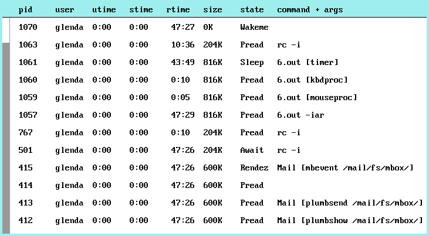

# vproc
a graphical version of ps(1) for 9front

## Keyboard shortcuts
q / Del to quit

Up / Down to scroll one line

Page Up / Down to scroll 10 lines

Home / End to scroll to the top or bottom

## Usage
By giving vproc the **-h flag** it will spit out the following:

``vproc [-a] [-i] [-h] [-r] [-d seconds] [-s sortfmt]``

The **-a flag** displays the arguments passed to each process.

The **-i flag** reverses the sorting (normally it is sorted by the pid like ps)

The **-h flag** displays the help message

The **-r flag** displays the elapsed real time

The **-d flag** sets the delay (in seconds) between each fetch cycle.\
Note: The default value is once every 5 seconds.

The **-s flag** determines how the list should be sorted. If the
flag is not specified it will default to **p**, which is the same
behaviour as ps(1). The *sortfmt* is expected to be one or more of
the following:

- p  sort by PID
- U  sort by username
- u  sort by user time
- s  sort by system time
- r  sort by real time
- m  sort by memory usage
- S  sort by process state
- c  sort by command

## Bugs
Yes.

## Features missing
[Most likely](https://github.com/thimc/vproc/blob/main/TODO).
